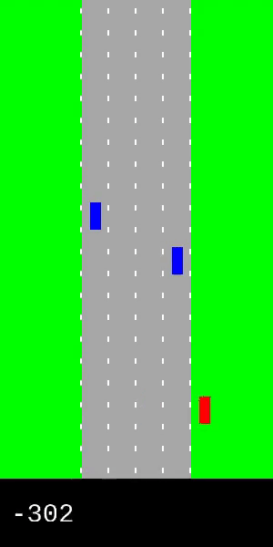
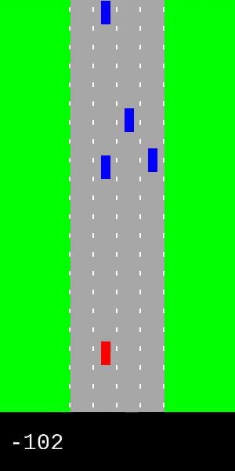

# env-Motorway
Simple Motorway simulated as an OpenAI gym environment 

# Installation
To install the environment, just go to the gym-Motorway folder and run the command:

pip install -e .

# Import the environment

import gym

import gym_Motorway

env = gym.make('Motorway-v0')

# Epsiod 0

# Epsiod 900

